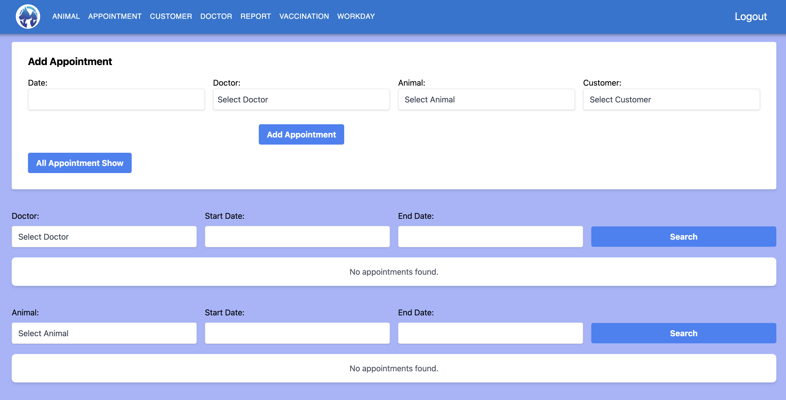

# Veterinary Management System Frontend

This is the frontend application for the Veterinary Management System. It is built using React and Tailwind CSS to manage customers, animals, vaccines, doctors, available dates, and appointments.

## Table of Contents

- [Links](#links)
- [Images](#images)
- [Installation](#installation)
- [Usage](#usage)
- [API Endpoints](#api-endpoints)
- [Components](#components)
- [Pages](#pages)
- [Contributing](#contributing)
- [License](#license)

## Links

- Frontend Repository: [https://github.com/akarsu35/Vet-App](https://github.com/akarsu35/Vet-App)
- Koyeb Deployment: [https://vital-aleece-vetapps-169c5c6c.koyeb.app/](https://vital-aleece-vetapps-169c5c6c.koyeb.app/)
- Netlify Deployment: [https://gentle-hamster-33e32d.netlify.app/](https://gentle-hamster-33e32d.netlify.app/)

## Images

The public/images directory contains the following images:

<p align="center">
  
  
  
  
</p>
<p align="center">
  
  
  
</p>

## Installation

To get started with the project, clone the repository and install the dependencies:

```bash
git clone https://github.com/your-username/vet-management-frontend.git
cd vet-management-frontend
npm install
```

## Usage

To start the development server, run:

```bash
npm run dev
```

```bash
example : http://localhost:5173/
```

This will launch the app and automatically open it in your default web browser. The app will reload if you make edits. You will also see any lint errors in the console.

## API Endpoints

The frontend interacts with the following backend API endpoints:

### Customers

- `GET /api/v1/customers/{id}`: Fetch a customer by ID
- `PUT /api/v1/customers/{id}`: Update a customer by ID
- `DELETE /api/v1/customers/{id}`: Delete a customer by ID
- `GET /api/v1/customers`: Fetch all customers
- `POST /api/v1/customers`: Add a new customer
- `GET /api/v1/customers/searchByName`: Search customers by name

### Animals

- `GET /api/v1/animals/{id}`: Fetch an animal by ID
- `PUT /api/v1/animals/{id}`: Update an animal by ID
- `DELETE /api/v1/animals/{id}`: Delete an animal by ID
- `GET /api/v1/animals`: Fetch all animals
- `POST /api/v1/animals`: Add a new animal
- `GET /api/v1/animals/searchByName`: Search animals by name
- `GET /api/v1/animals/searchByCustomer`: Search animals by customer

### Vaccines

- `GET /api/v1/vaccines/{id}`: Fetch a vaccine by ID
- `PUT /api/v1/vaccines/{id}`: Update a vaccine by ID
- `DELETE /api/v1/vaccines/{id}`: Delete a vaccine by ID
- `GET /api/v1/vaccines`: Fetch all vaccines
- `POST /api/v1/vaccines`: Add a new vaccine
- `GET /api/v1/vaccines/searchByVaccinationRange`: Search vaccines by vaccination range
- `GET /api/v1/vaccines/searchByAnimal`: Search vaccines by animal

### Doctors

- `GET /api/v1/doctors/{id}`: Fetch a doctor by ID
- `PUT /api/v1/doctors/{id}`: Update a doctor by ID
- `DELETE /api/v1/doctors/{id}`: Delete a doctor by ID
- `GET /api/v1/doctors`: Fetch all doctors
- `POST /api/v1/doctors`: Add a new doctor

### Available Dates

- `GET /api/v1/available_dates/{id}`: Fetch an available date by ID
- `PUT /api/v1/available_dates/{id}`: Update an available date by ID
- `DELETE /api/v1/available_dates/{id}`: Delete an available date by ID
- `GET /api/v1/available_dates`: Fetch all available dates
- `POST /api/v1/available_dates`: Add a new available date

### Appointments

- `GET /api/v1/appointments/{id}`: Fetch an appointment by ID
- `PUT /api/v1/appointments/{id}`: Update an appointment by ID
- `DELETE /api/v1/appointments/{id}`: Delete an appointment by ID
- `GET /api/v1/appointments`: Fetch all appointments
- `POST /api/v1/appointments`: Add a new appointment
- `GET /api/v1/appointments/searchByDoctorAndDateRange`: Search appointments by doctor and date range
- `GET /api/v1/appointments/searchByAnimalAndDateRange`: Search appointments by animal and date range

## Pages

The pages are organized in the `src/Pages` directory. Each page corresponds to a route in the application.

- `Customer.jsx`: Displays detailed information about a customer
- `Animal.jsx`: Displays detailed information about an animal
- `Vaccination.jsx`: Displays detailed information about a vaccine
- `Doctor.jsx`: Displays detailed information about a doctor
- `Workday.jsx`: Displays detailed information about an available date
- `Appointment.jsx`: Displays detailed information about an appointment
- `Home.jsx`: Home page for all pages
- `Report.jsx`: Displays detailed information about a report

## Additional Components

The components are organized in the `src/Components` directory. Each component is responsible for rendering a specific part of the UI.

- `Navbar.jsx`: Renders the navigation bar for the application
- `Snackbar.jsx`: Displays status messages (success and error) for operations such as customer registration. It also shows backend-defined errors as alerts.
- `Loading.jsx`: Displays a loading indicator while data is being fetched.

## Contributing

Contributions are welcome! Please feel free to submit a Pull Request.

1. Fork the repository
2. Create a new branch (`git checkout -b feature-branch`)
3. Commit your changes (`git commit -m 'Add some feature'`)
4. Push to the branch (`git push origin feature-branch`)
5. Open a Pull Request

## License

This project is licensed under the MIT License. See the [LICENSE](LICENSE) file for details.
